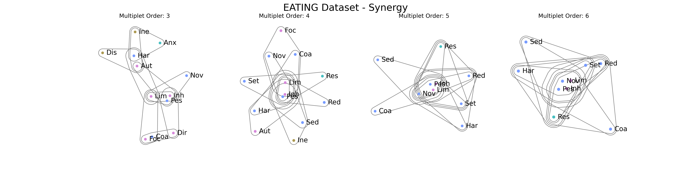
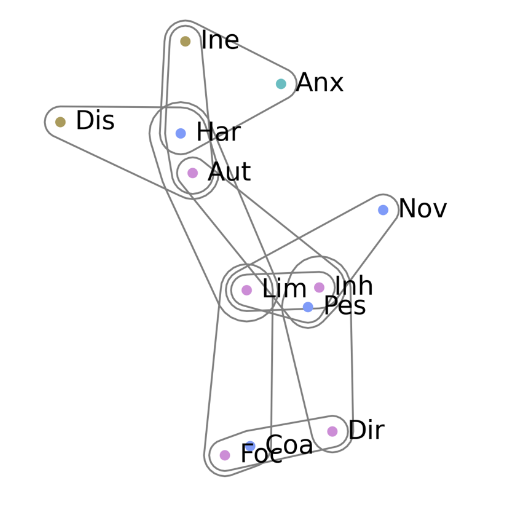

=======


# hyperplot
A short high-level library to plot high-order interactions based on HyperNetX.

Visualization functions:
=======
**Authors:** Renzo Comolatti and Daniele Marinazzo
<br />

## Visualization functions:
```python

two_rows(decomposed_edges, nodelabels=nodelabels, nodecolors=nodecolors, column_spacing=2.5, nodesize=0.11, subplot_width=12)

areas(decomposed_edges, nodelabels=None, nodecolors=None, edgecolors=None, linewidth=1)

planar(decomposed_edges, nodes, nodelabels=nodelabels)
```

## Requirements

1. networkx==2.3

2. my HyperNetX fork at 'new_viz' branch
 
`git clone -b new_viz https://github.com/renzocom/HyperNetX.git`
